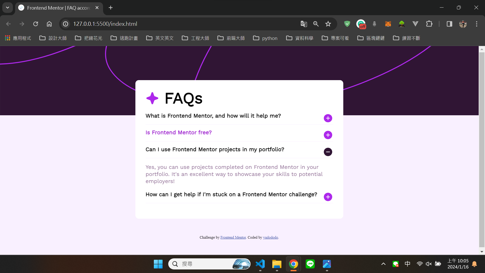
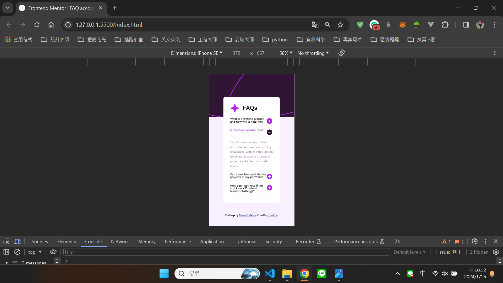

## Overview👀

Hello visitors, I created this github repo to help me practice and showcase my not so refined html and css skill.
Hope that you get a grasp of my current front end skills and help me improve what I lack by sending feedbacks.

## Screenshot🐻💥

## The challenge🔥

Users should be able to:

- Hide/Show the answer to a question when the question is clicked
- Navigate the questions and hide/show answers using keyboard navigation alone
- View the optimal layout for the interface depending on their device's screen size
- See hover and focus states for all interactive elements on the page
  
## What I learned💪

By doing this webpage I finally start to writing JS❗

## Author🐶

- Frontend Mentor - [@yudododo](https://www.frontendmentor.io/profile/yudododo)
- Instagram - [@yu_dododo](https://www.instagram.com/yu_dododo/)
